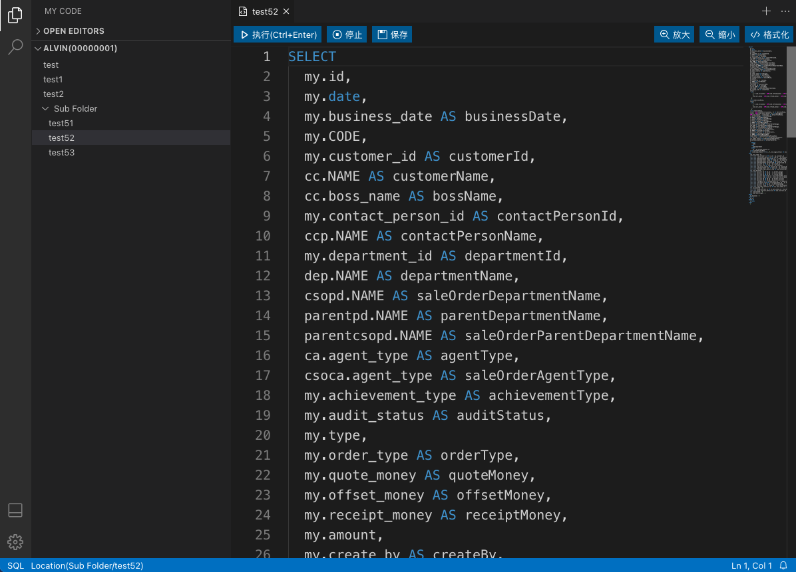

### Web IDE

一款用于大数据平台的即席查询的 SQL WEB IDE 工具, 整合了 [ali-react-table](https://ali-react-table.js.org/) 和 [Molecule](https://github.com/DTStack/molecule) 两大开源工具，完美解决WEB IDE 架构与大数据表表格性能优化问题。



#### TODO
- [ ] 在查询多次结果数据之后可能存在前端内存过高的问题，可以采用 chrome 外置数据库进行存储，将所有存储结果存放在数据库当中以保证页面内存不会触达上限。

#### Usage
```
npm install
npm run start
```